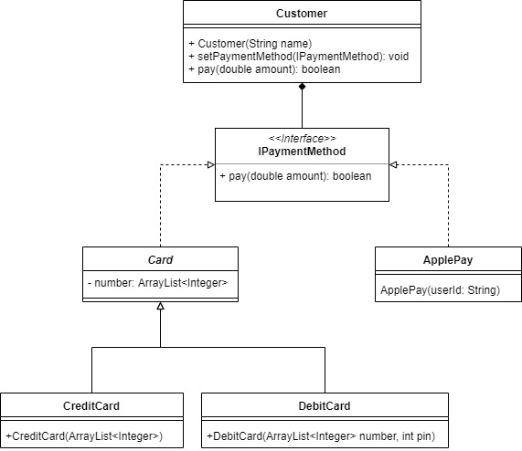

# MIDTERM EXAM

## Problem 1 [30 points]
The <code>q1</code> directory contains code that does not compile. Fix compiler erros and run the code. You will then see a run-time error that is caused by something in the code. Find the spot in the code that causes this error and fix it. When you run the working version of this code, you should expect it to create a <code>q1/results.txt</code> file.

## Problem 2 [35 points]

Consider the UML diagram below. The <code>q2</code> directory contains <code>Custmer.java</code> and <code>Driver.java</code> classes. Write the rest of the classes in the <code>q2</code> directory, as shown in the UML diagram. You do not need to implement the details of each method, just sketch them out so that the code compiles and is consistent with the UML diagram. Note that in the diagram, the <code>Card</code> class is in <i>italics</i>, which means abstract.

## Problem 3 [35 points]

The <code>q3</code> direcotry contains classes that share some duplicate code. Refactor this code: use inheritance to remove code duplication. Work out of <code>q3</code> directory: replace the original code with your refactored code.
